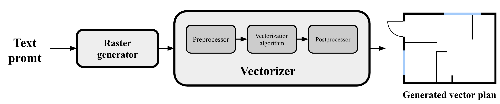
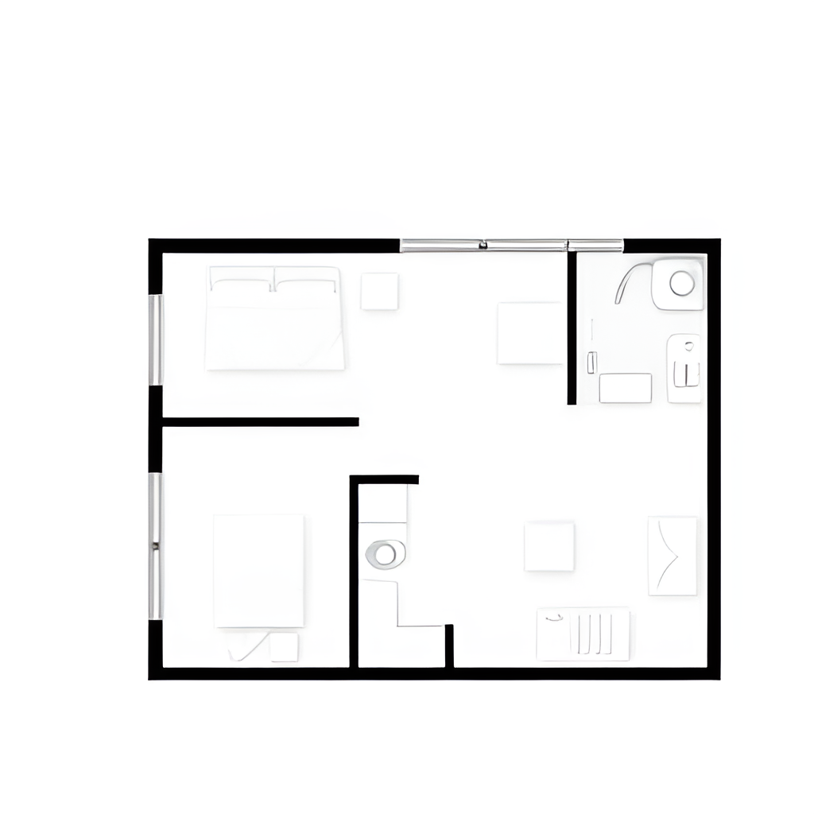
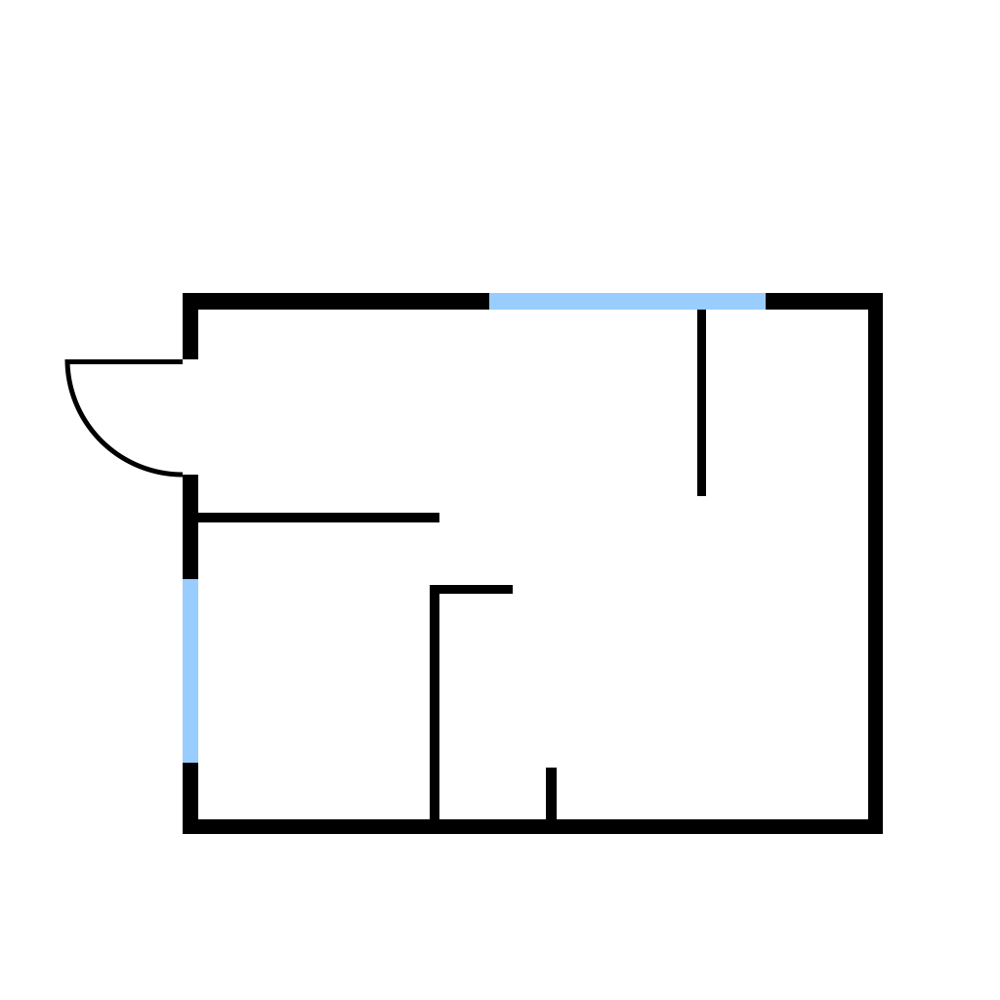

# GenPlan : Generation Vector Residential Plans Based on the Textual Description

Contacts: [Egor Bazhenov](tujh.bazhenov.kbn00@mail.ru)

## Scheme of the method

 

We present an algorithm for generating vector residential plans 
based on a text description.

## Generation example
| Text prompt                                                                                                                                                                                                                            | Raster Image                            | Vector Image                  |
|----------------------------------------------------------------------------------------------------------------------------------------------------------------------------------------------------------------------------------------|-----------------------------------------|-------------------------------|
| A minimalist 2D floor plan of an empty studio apartment without any text, featuring clean black lines and white spaces, showcasing an open layout with designated areas for living, sleeping, and kitchen.  without words on a picture |             |   |

## Usage

1. ``git clone https://github.com/CTLab-ITMO/GenPlan``
2. ``pip install requirements.txt``
3. ``python pipline.py --text "your text promt" --output_svg "svg_path"``

## Setting parameters

Individual settings can be configured by [config file](config.py) for your task. 

| Parameter name     | Description                                      | Type   |
|--------------------|--------------------------------------------------|--------|
| PNG_PATH           | Generated bitmap image path                      | String |
| CLEAN_PNG_PATH     | Cleaned bitmap image path                        | String |
| BLACK_COLOR_BORDER | Color filtering maximum value                    | Float  |
| MAX_PERCENTILE     | Maximum pixel differences percentage             | Float  |
| MAX_VALUE          | Maximum value of dissimilar pixels               | Int    |
| MIN_THICKNESS      | Minimum thickness of a vector line               | Int    |
| MAX_DEVIATION      | Maximum deviation of points from a straight line | Int    |