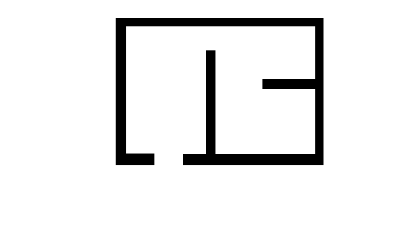
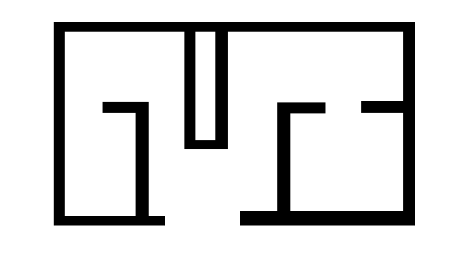

# GenPlan: Generator of vector plans

Контакты: [Егор Баженов](tujh.bazhenov.kbn00@mail.ru)

## Примеры работы алгоритма
| Текстовое описание                                                  | Растровое изображение        | Векторное изображение        |
|---------------------------------------------------------------------|------------------------------|------------------------------|
| One-room apartment with a separate kitchen                          |  |  |
| One-bedroom apartment with rooms on different sides of the entrance |  |  |

Мы представляем алгоритм генерации векторных планов жилых помещений 
на основе текстого описания.

## Использование

1. ``git clone https://github.com/CTLab-ITMO/GenPlan``
2. ``pip install requirements.txt``
3. ``python pipline.py --text "your text promt" --output_svg "svg_path"``

## Настройка

Можно настроить отдельные параметры [config file](config.py) для вашей задачи 

| Название параметра | Описание                                                                    | Тип    |
|--------------------|-----------------------------------------------------------------------------|--------|
| PNG_PATH           | Пусть до растрового изображения                                             | String |
| MAX_PERCENTILE     | Максимально допустимое соотношение между верными пикселями для векторизации | Float  |
| MAX_VALUE          | Максимально допустимое количество неверных пикселей для векторизации        | Int    |
| MIN_THICKNESS      | Минимальная толщина векторной линии                                         | Int    |
| MAX_DEVIATION      | Максимальное значение отклонения точек от единой прямой                     | Int    |
