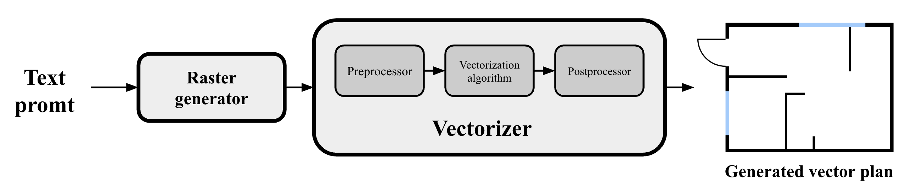
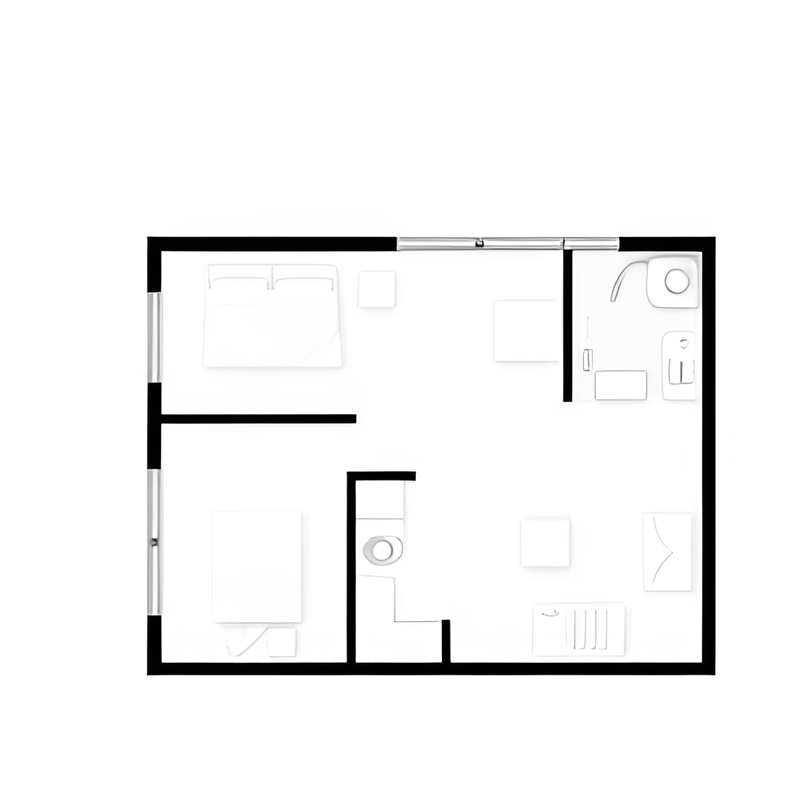
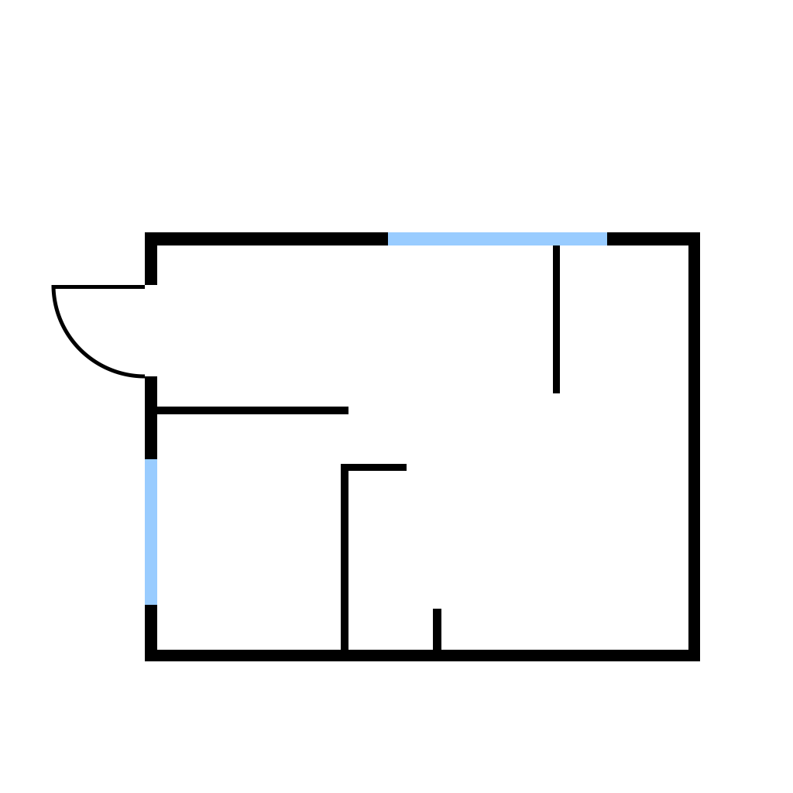

# GenPlan : Generation Vector Residential Plans Based on the Textual Description [[RU](README_RU.md)/[EN](README.md)]

Контакты: [Егор Баженов](mailto:tujh.bazhenov.kbn00@mail.ru)

## Схема метода

 

Мы представляем наш новый алгоритм генерации векторных планов жилых
помещений на основе текстового описания.

## Пример генерации
| Текстовое описание                                                                                                                                                                                                                     | Растровое изображение        | Векторное изображение        | 3D изображение               |
|----------------------------------------------------------------------------------------------------------------------------------------------------------------------------------------------------------------------------------------|------------------------------|------------------------------|------------------------------|
| A minimalist 2D floor plan of an empty studio apartment without any text, featuring clean black lines and white spaces, showcasing an open layout with designated areas for living, sleeping, and kitchen.  without words on a picture |  |  |  |

## Использование

1. ``git clone https://github.com/CTLab-ITMO/GenPlan``
2. ``pip install requirements.txt``
3. ``python pipline.py --text "your text promt" --output_svg "svg_path" --generation_model "model_name" --result_type "2d or 3d"``

## Настройка параметров

Настройки для вашей задачи можно выполнять с помощью [файла конфигурации](config.py). 

| Имя параметра      | Описание                                                                | Тип     |
|--------------------|-------------------------------------------------------------------------|---------|
| PNG_PATH           | Путь к сегенерированному растровому изображению                         | String  |
| CLEAN_PNG_PATH     | Путь к обработанному растровому изображению                             | String  |
| BLACK_COLOR_BORDER | Максимальное значение цветовой фильтрации                               | Float   |
| MAX_PERCENTILE     | Максимальная разница пикселей в процентах                               | Float   |
| MAX_VALUE          | Максимальное количество непохожих пикселей                              | Integer |
| MIN_THICKNESS      | Минимальная толщина векторной линии                                     | Integer |
| MAX_DEVIATION      | Максимальное отклонение точек от прямой линии                           | Integer |
| LOSS_SCALE         | Значение скалирования для white loss                                    | Float   |
| EDGING_TYPE        | Тип маски                                                               | String  |
| USE_WHITE_LOSS     | Используется ли white loss (реализовано только с генератором типа SDXL) | Boolean |

